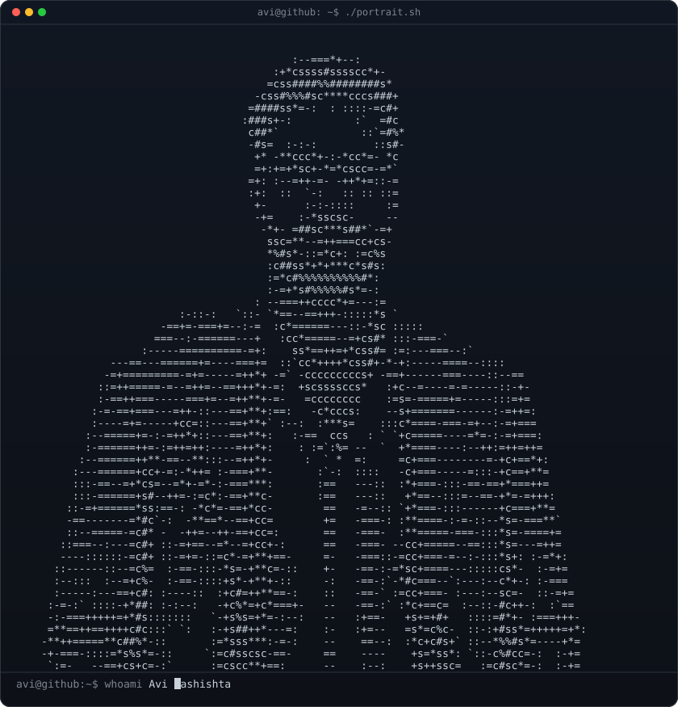

<table>
<tr>
<td valign="top"></td>
<td valign="top"></td>
</tr>
</table>

## Mohamed Mabrouk

**Software Engineer · Backend · Cloud & DevOps · AI**

Software Engineering student at ENSA Khouribga, focused on backend engineering, cloud, DevOps, and AI.

 

